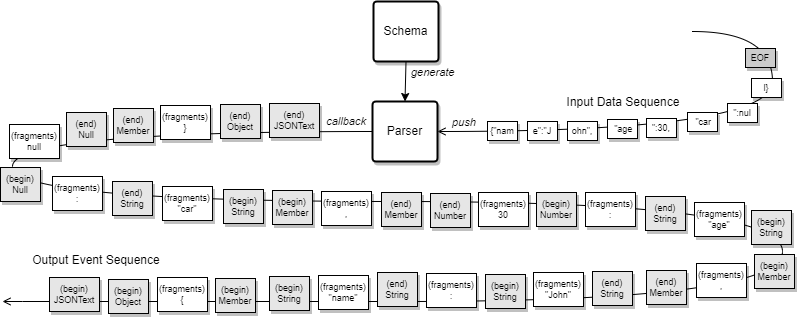

# Terp

[](https://github.com/torao/terp/actions)
[](https://coveralls.io/github/torao/terp?branch=main)

**Terp** is a stream-oriented syntactical parser for Rust, capable of sequentially processing fragmented input symbol sequences. This interprets input according to an application-defined syntax and produces a sequence marked up with *begin* and *end* pairs of non-terminal symbols.

## Overview

Terp is implemented for **streaming** or **pipelined** processing, where the processing is performed sequentially form the syntax that could be parsed, without waiting to read the entire fragmented input. This is also useful for read-eval-print loop (REPL) programs, such as interactive processors available on some programming language platforms, that read a line-by-line program fragments and evaluate from a finalised expression, while the unfinalized one waits for the remaining input.

It is also sutaible for an **infinite input streams**, or data with a length that is practically impossible to read into memory (however, the syntax for processing such input must be safely defined to be deterministic state by a practical number of look-aheads).

Another key feature of terp is that instead of matching alternatives using traditional $k$-lookahead prediction or backtracking, matching is done by **parallel evaluation** of parsing paths. It is more suitable for parsing in modern multi-core computer environments.

In the traditional definition, terp would be a variant of the recurisive-descent LL(k) parser, whwich can interpret context-free grammars (CFG). For more information on using terp, see the [Reference Guide](doc/README.md).

## Features

### Easy-to-describe Schema

Instead of using complex function combination, the schema can be described in a BNF or PEG-like manner with better visibility. The following example is a JSON string defined in [RFC 8259](https://www.rfc-editor.org/rfc/rfc8259.html) defined in terp, where `A & B` means that `B` appears after `A`, `A | B` means that `A` or `B` appears, and `A * (X..=Y)` means `X` to `Y` repetitions of `A`.

```rust
let schema = Schema::new("JSON String")
  .define("String",    id("Quote") & (id("Char") * (0..)) & id("Quote"))
  .define("Quote",     ch('\"'))
  .define("Char",      id("Unescaped") | id("Escape") & (one_of_chars("\"\\/bfnrt") | (ch('u') & (id("Hex") * 4))))
  .define("Escape",    ch('\\'))
  .define("Unescaped", range('\x20'..='\x21') | range('\x23'..='\x5B') | range('\x5D'..='\u{10FFFF}'))
  .define("Hex",       range('0'..='9') | range('a'..='f') | range('A'..='F'));
```

The schema is references as immutable while the parser is parsing.

### State-Machine Designed Parser

The parser updates its state for incoming data sequence fragments and sequentially outputs marked-up sequence as events when the meaning is determined (this is similar to the SAX parser in XML). This terp parser behaves like a pipeline, which is useful for streaming processes that read and parse fragmented data from sockets or other inputs.



Input data sequences will work no matter what delimitations they are fragmented into. The resulting output data sequence are passed as event callbacks.

```rust
let mut events = Vec::new();
let mut parser = Context::new(&schema, "String", |e:Event| events.push(e)).unwrap();
parser.push_str("\"t").unwrap();
parser.push_str("e").unwrap();
parser.push_str("rp\"").unwrap();
parser.finish().unwrap();
println!("{:?}", events);
```

The events called back are a sequence marked up with the input sequence by identifiers' BEGIN-END pair. This constitutes a tree structure organized by meaning, similar to the structure of XML.

```
EventKind::Begin("String")
EventKind::Begin("Quote")
EventKind::Fragments("\"")
EventKind::End("Quote")
```

* The supported data sequences are abstracted, allowing parsers to be built for strings, byte arrays, or any other data sequence.
* Multiple routes are matched in parallel using [`rayon`](https://github.com/rayon-rs/rayon) framework.
* This is not so fast as dedicated parser implementations optimized for the schema. It is suitable for parsing domain-specific data for which a dedicated parser doesn't exist, or for use as a comparison to see if the dedicated parser is working properly.
